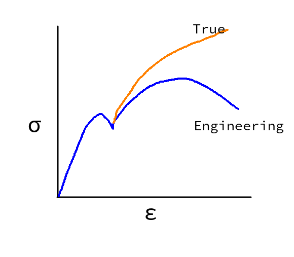
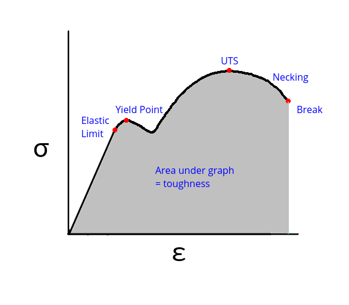

Engineering mechanics
=====================

.. admonition:: Syllabus Excerpt

   * truss analysis

     * actions (loads)

     * reactions

     * pin jointed trusses only

     * method of joints

     * method of sections

   * bending stress induced by point loads only

     * concept of shear force and bending moment

     * shear force and bending moment diagrams

     * concept of neutral axis and outer fibre stress

     * bending stress calculation (second moment of area given)

   * uniformly distributed loads

   * stress and strain

     * shear, compressive and tensile stress

     * engineering and true stress

     * yield stress, proof stress, toughness, Young’s modulus, Hooke’s law, engineering applications

     * factor of safety 

     * stress/strain diagram

    |syllabus-nesa|_

Truss Analysis
---------------

Bending Stress Induced By Point Loads
-------------------------------------

Uniformly Distributed Loads
---------------------------

Stress and Strain
-----------------

Shear, Compressive and Tensile Stress
^^^^^^^^^^^^^^^^^^^^^^^^^^^^^^^^^^^^^

Compressive forces are forces which squeeze an object, and will reduce the length.
Tensile forces are forces which stretch and will lengthen the object.
Shear forces are forces acting along the cross section of an object (highlighted in red).

Stress and strain are calculated with the following formulae:

.. math::

  \begin{array}{ll}
    \sigma = \frac{F}{A} & \varepsilon = \frac{e}{L}
  \end{array}

.. math::

  \begin{array}{llll}
    \sigma & \text{stress (MPa)} & \varepsilon & \text{Strain (unitless)} \\
    F & \text{Force (N)} & e & \text{Elongation (mm)} \\
    A & \text{Area ($\text{mm}^2$)} & L & \text{Original Length (mm)} \\
  \end{array}

.. list-table::
    :width: 90%
    :align: center

    * - Tensile
      - Compressive
      - Shear

    * - .. image:: images/tensile-force.png

        
        $A = \pi{}r^2$

      - .. image:: images/compressive-force.png

        
        $A = \pi{}r^2$

      - .. image:: images/plate-shear-force.png

        $A = \pi{}d{h}$

        .. image:: images/tube-shear-force.png

        $A = \pi{}r^2$

Engineering and True Stress
^^^^^^^^^^^^^^^^^^^^^^^^^^^

Engineering / nominal stress is the stress when the diameter of the material is assumed to be constant,
i.e. the same size as it was before the beginning of uniform reduction in area of test specium or necking.
This is easier to work with and is (mostly) the same in the elastic zone - which engineers try to stay within regardless.

True / Working stress is the actual stress the material experiences.
As the material reduces in area, the stress increases.

During plastic deformation, fatigue occurs and the material has weakened even after the force is removed.

Stresses, Toughness, Young's Modulus, Hooke's Law, Engineering Applications
^^^^^^^^^^^^^^^^^^^^^^^^^^^^^^^^^^^^^^^^^^^^^^^^^^^^^^^^^^^^^^^^^^^^^^^^^^^

Yield Stress
  The point after which their is an increase in strain without increase in stress.
  Located just after the straight line line section on the graph.

Proof Stress
  - A type of stress used when their is no definite yield point in a material e.g. aluminium / rubber.
  - You allow some percentage of strain (e.g. 0.1% - 0.2%).
  - Allows the materials to be "safely" used with a higher amount of stress

    - tradeoff is that they need to be replaced often due to creep.

    - Used for aluminium as it has low elastic limit; thus allows much higher safe loads with weight savings.

  .. image:: images/proof-stress.png
     :width: 50%
     :align: center

Toughness
  A measure of the impact resistance of a material.
  Represented as the area under the stress/strain graph.
  Is measured with an izod or charpy machine.

Young's Modulus
  Material stiffness.
  Measured as the gradient of the straight line section.

  .. math:: 

     E = \frac{\sigma}{\varepsilon}

  .. math::

    \begin{array}{ll}
      E & \text{Young's Modulus (GPa)} \\
      \sigma & \text{Stress (MPa)} \\
      \varepsilon & \text{Strain (unitless/percentage)} \\
    \end{array}

  Hooke's Law
    $F=-kx$
    It tells us that elastic deformation is a straight line gradient.
    $k$ would be Young's Modulus.

Factor of Safety
^^^^^^^^^^^^^^^^
- Materials are never entirely perfect and it is diffficult to accurately determine the working loads
- The factor of safety allows for defects in the materials or manufacturing
- The factor of safety changes with the relevant risk:

  - In bridges and planes, the risk is much higher: factory of safety is often 4-5x
  - In bikes, the risk is lower, and so the factory of safety maybe be only 2x.

Stress/Strain Diagram
^^^^^^^^^^^^^^^^^^^^^

Tensomers measure force and elongation; not stress and strain. 
This creates a load-extension diagram, not a stress-strain diagram.
Load-extension is specific to specimen, stress-strain is not.

