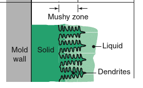
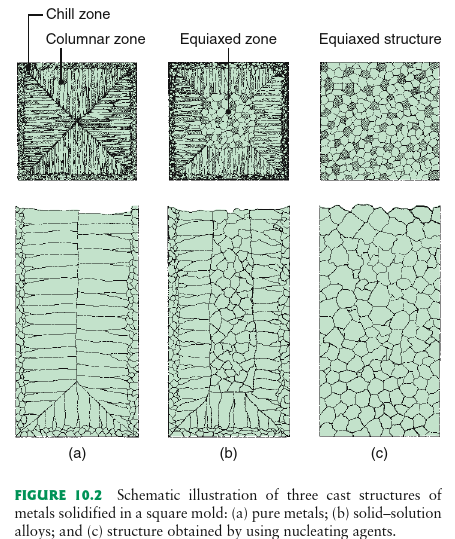
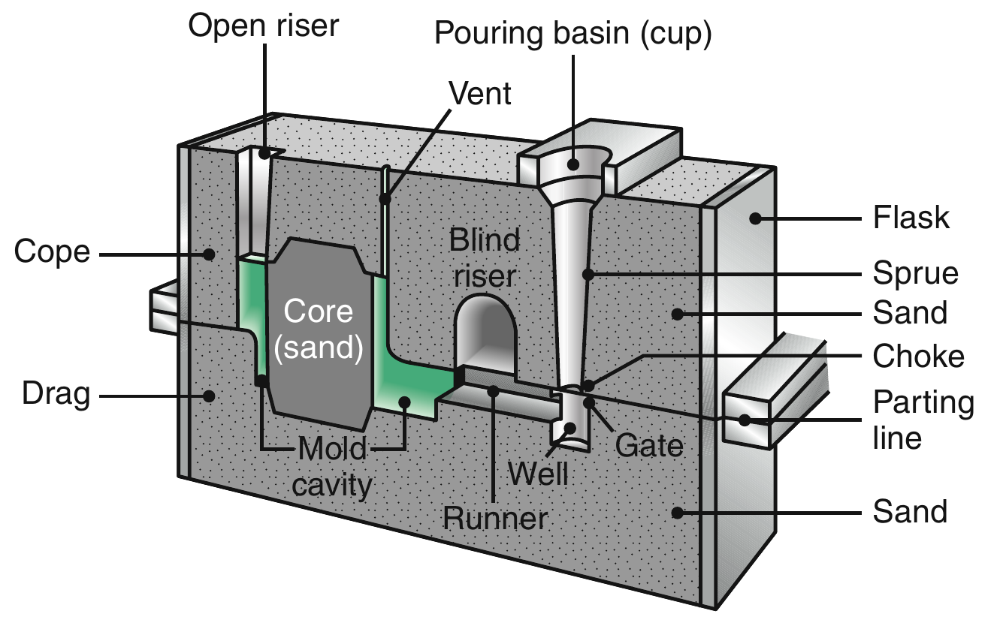
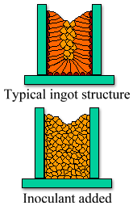
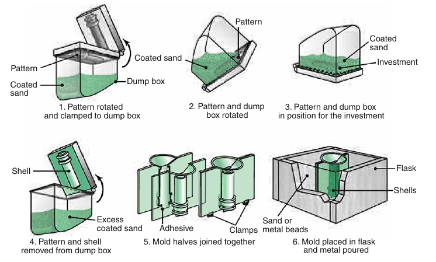
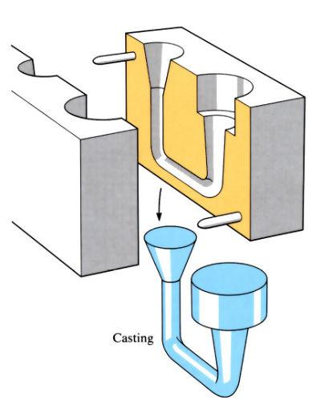
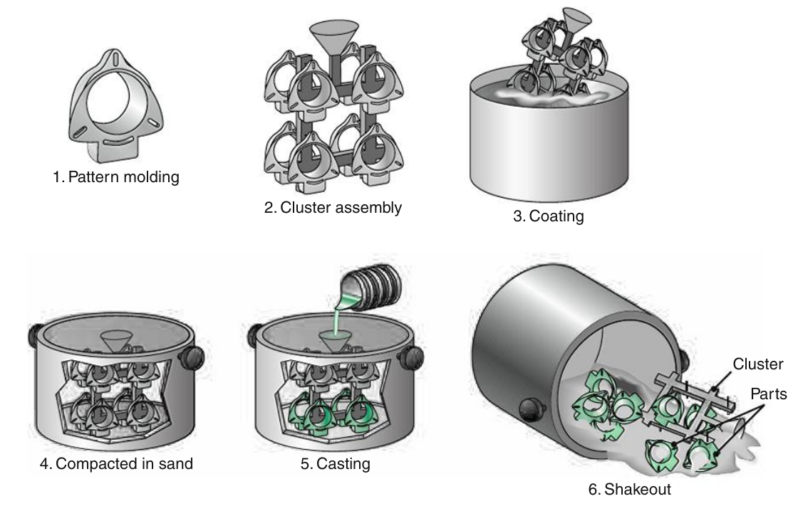
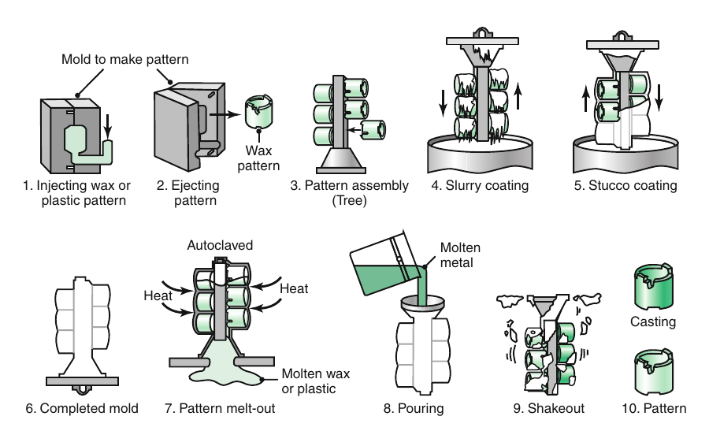

Engineering materials
=====================

.. admonition:: Syllabus Excerpt

   * testing of materials

     * hardness

     * impact

   * heat treatment of ferrous metals

     * annealing

     * normalising

     * hardening and tempering

     * changes in macrostructure and microstructure

     * changes in properties

   * manufacturing processes for ferrous metals

     * forging

     * rolling 

     * casting

     * extrusion

     * powder forming

     * welding

   * changes in macrostructure and microstructure of ferrous metals

   * changes in properties of ferrous metals

   * manufacturing processes for non-ferrous metals

     * alloying

     * annealing

     * solid solution hardening

   * changes in macrostructure and microstructure of non-ferrous metals

   * changes in properties of non-ferrous metals

   * ceramics and glasses

     * as an insulation material 

     * laminating and heat treatment of glass

     * structure/property relationship and their application

   * thermo softening polymers

     * engineering textiles

     * manufacturing processes 

       * extrusion

       * injection moulding

       * blow moulding

     * 	structure/property relationships and application

    |syllabus-nesa|_

Testing of Materials
--------------------

Heat Treatment of Ferrous Metals
--------------------------------

Manufacturing Processes for Ferrous Metals
------------------------------------------
Forging
^^^^^^^
* Where metal is deformed due to compressive or high impact forces
* Forged objects are **stronger** than machined objects as it creates grainflow
* Functions that can be performed by forging are:

  * Upsetting

    * Flattening the metal
    * Increases cross-sectional area by reduces length

  * Drawing

    * Metal drawn out by hammering along sides
    * Increases length by reducing cross-sectional area

Hot Forging
~~~~~~~~~~~
* The metal is heated to above **recrystallisation** temperature and then worked at the temperature
* After working it is left to cool
* Much easier to change the shape of the metal as it becomes malleable
* (heating) will relieve internal stresses, increasing :term:`toughness` and durability but decreases the :term:`hardness`

  * prevents strain hardening
  * FCC not BCC is formed
  * due to heating, the material can warp due to thermal contraction/expansion -> low dimensional accuracy and poor surface finish

Cold Forging
~~~~~~~~~~~~
* **Large** amounts of force are applied to the metal at (mostly) room temperature
* usually for softer metals
* retains dimensional acccuracy and surface finish
* However, creates residual stresses which leads to lower ductility and toughness, but harder
* Can often be accompanied by later annealing to relieve stresses

Rolling
^^^^^^^
Metal is passed through a set of rolls, which exert a compressive force on the sheet. This creates a reduction thickness an extension in length.

Hot Rolling
~~~~~~~~~~~
* Done at temperatures above recrystallisation
* Produces fine, equiaxed, and unstressed grains
* Requires less force
* Not dimensionally accurate or good surface finish
* Can form an oxide layer

Cold Rolling
~~~~~~~~~~~~
* Produces elongated and **stressed** grains
* Harder and stronger final product
* Better surface finish
* Less ductile
* Elongated grains -> only strong in two dimensions
* Requires high amounts of form

Casting
^^^^^^^

A general category involving **pouring molten metal into a mould**.
Most of the difference comes in how the mould is made.

The solidification of pure metals has a defined temperature at which the metal transitions from liquid to solid. This causes a solidification front to move through the material, from the outer walls into the centre. Non-pure metals have a range of temperatures where the metal solidifies, this is the 'mushy' region.

At the mould walls, the metal cools rapidly and creates an outer shell of equiaxed grains. Grains will then grow opposite direction of heat transfer, forming columnar grains inwards on the material. Further away from the walls, the grains grow slower and are able to become equiaxed and course. The addition of nucleating agents (see (c)) creates course grains throughout. In alloys, dendrites form of the material with a higher freezing point.

    From Manufacturing Engineering & Technology [6 ed], pg. 241

    From Manufacturing Engineering & Technology [6 ed], pg. 239

Slower cooling creates coarser structures, and faster cooling creates finer dendritic structures.

Smaller grain size increases strength and ductility. Lack of uniform grain structures create anisotropic properties (not uniform in all directions).

Convection within the metal promotes the formation of the outer chill zone and the transition from columnar to equiaxed grains. Reducing convection creates more columnar structures.

Sand Casting
~~~~~~~~~~~~

    From Manufacturing Engineering & Technology [6 ed], pg. 263

#.  A pattern (made from wood or other material) is made from a design by a skilled pattern maker; in two parts, the cope and the drag [top and bottom] and mounted on plates
#. The cope pattern is placed within a flask, alongside a pattern for a sprue (for adding metal) and riser. It is then filled with sand that is then rammed to compact it.
#. This is repeated with the drag, except there is no sprue or riser.
#. The patterns are then removed.
#. The cope and drag are assembled together.
#. Metal is then poured into the sprue via the pouring basin

    * The pouring basin is used to ensure consistent flow of metal

#. The metal is then allowed to cool and then the cope and drag are separated. The excess parts created by the runner and riser are then machined off.
#. The sand can then be reused

**Advantages of sand casting:**

* Cost effective
* Relatively simple to do
* Suitable for small or large production runs

**Disadvantages:**

* Poor surface finish -> fatigue cracking
* Poor dimensional tolerance and stability
* Grains are often columnar

  * Properties become :term:`anisotropic`
  * Large grains reduce ductility
  * Weakness where columnar grains meet equiaxed grains
  * Resolved with the addition of innoculants, which encourage nucleation (formulation of new crystals)

    From `Materials Engineering Online Tutorials: Casting <https://textbooks.elsevier.com/manualsprotectedtextbooks/9780750663809/Static/casting/casting2b.htm>`_

Shell Moulding
~~~~~~~~~~~~~~

    From Manufacturing Engineering & Technology [6 ed], pg. 268

#. A metal (usually cast iron) pattern is made by hand and is then heated to ~200-300C
#. Fine silica sand combined with ~5% thermosetting phenotic resin is then dumped onto the metal pattern, and left to cure for a few minutes.
#. The pattern + sand are then inverted, allowign the excess (non-cured) sand to drop free. This leaves a 10-20mm shell.
#. The pattern + sand are then placed in an oven to finish curing.
#. The shell is then removed from the pattern via a removing pin, and combined with #. the other half of the shell by clamping/gluing/adhsive, forming a mold.
#. The shell is then placed in a flask filled with shot or sand.
#. Metal can then be poured into the shell and left to set.
#. The shell is then removed and **discarded**.

**Advantages:**

* can be completely automated
* law labour cost
* efficient
* very good surface finish and dimensional tolerance
* relatively short lead time (~weeks)
* large and complex parts can be produce (similar to sand casting)

**Disadvantages:**

* the initial cast iron pattern is moderately expensive to make and hence requires long runs to be economical
* the dumping / shell moulding machine is expensive
* can be highly porous
* part size limited

Permanent Metal Mould / Gravity Die Casting
~~~~~~~~~~~~~~~~~~~~~~~~~~~~~~~~~~~~~~~~~~~

    From `OpenLearn: Gravity die casting <https://www.open.edu/openlearn/science-maths-technology/engineering-technology/manupedia/gravity-die-casting>`_

#. A die is made from steel. This is **very expensive** and can take a while to make. It integrates the sprue and riser as part of the mould.
#. The die **must** be able to be separated along one plane
#. Metal can be poured into the mould, left to cool, then the mould is pulled apart

**Advantages:**

* good dimensional accuracy and surface finish
* high production rate

**Disadvantages:**

* high die cost
* limited part size
* long lead time
* limited to nonferrous metals e.g. aluminium as the melting point needs to be lower than that of the die itself

Pressure Die Casting
~~~~~~~~~~~~~~~~~~~~

Similar to gravity die casting but is done under high pressure.

**Advantages:**

* excellent dimensional acuracy and surface finish (pressure forces into surface)
* high production rate

**Disadvantages:**

* lead time of up to a few months
* very expensive die cost

Lost Foam Casting
~~~~~~~~~~~~~~~~~

    From Manufacturing Engineering & Technology [6 ed], pg. 271

#. A pattern is made from polystyrene by heating polystyrene beats containing pentane inside of an aluminium die, which is then separated
#. The polystyrene foam is then placed in a box with fine sand which is then compacted.
#. Molten metal is poured in and vapourises the foam pattern.

**Advantages:**

* simple process as no parting lines, risers, or cores
* minimal cleaning and finishing operations necessary

**Disadvantages:**

* die cost is expensive
* metal cools faster as energy is taken out through vapourisation of foam
  * formation of more columnar structures rather than equiaxed
* patterns low strength

Investment Casting
~~~~~~~~~~~~~~~~~~

    From Manufacturing Engineering & Technology [6 ed], pg. 273

#. A pattern is created of wax through moulding or other techniques
#. The wax patterns are often joined together in large trees, then covered in a fine silica and binders
#. Once dried, it is then repeatedly coated in more sand to increase the strength of the mould
#. The mould is then heated (~150C) to melt out the wax
#. It is then fired at 600-1000C to burn out any remaining wax or chemicals
#. Molten metal is then poured into the mould and then the mould is broken up to reveal castings

Can be used for manufacture of orthopedic replacements e.g. the knee.
Suitable for use with titanium, chrome, or cobalt alloys.

**Advantages:**

* excellent surface finish and dimensional accuracy
* very high production rates
* can cast high melting point alloys
* removes the need for most finishing or machining processes, which can reduce cost
* creates equiaxed grains through the mould, leading to better properties
* thin walls (1.5mm) can be created

**Disadvantages:**

* expensive tooling cost, lead time of a few weeks
  * creation of both wax mould and then this secondary mould
* part size limited (up to ~35kg)
